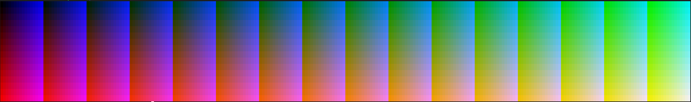

# `Sista` demo

This directory contains a set of demo programs that showcase the features of the `Sista` library. Each demo is a standalone program that demonstrates a specific aspect of the library.

## Demos

- `header-test`: A simple program that tests the usage from source of `Sista`
- `shared-test`: A program that tests the shared library usage of `Sista` for dynamic linking
- `shared-test-static`: A program that tests the shared library usage of `Sista` for static linking
- `colors24-bit`: showcases the 24-bit color support
- `colors256`: showcases the 256-color support
- `conflictTest`: tests the conflict resolution features of `sista::SwappableField`
- `resetAttribute`: tests the `sista::resetAttribute` function
- `screen-mode`: showcases the screen modes being changed
- `swapTest`: two pawns swapping places in a `sista::SwappableField`
- `verticalTest`: tests the vertical pacman effect

Consider that some demos are made to verify the terminal's support for certain features, and not all of them will always work as expected on every terminal. The demos are designed to be run in a terminal that supports ANSI escape codes and the features being tested, that often go beyond the standard ANSI capabilities.

## Building the demos

These demos do not require the installation of `Sista` to build. You can compile them directly using `g++`. 

```bash
g++ -std=c++17 -Wall -Wno-narrowing -Wno-sign-compare -g -c header-test.cpp
g++ -std=c++17 -Wall -g -o header-test header-test.o ansi.o border.o coordinates.o cursor.o field.o pawn.o
```

You can replace `header-test.cpp` with any of the other demo files to compile them. The `Makefile` in this directory provides a convenient way to build all demos at once. It does not however, for convenience reasons, include the tests that require the shared library to be installed.

```bash
make
# Equivalent to running: make all
```

All demos are compiled with debugging symbols enabled, which allows you to run them in a debugger if needed.

To clean up the compiled objects and executables, you can run:

```bash
make clean
```

This will remove all object files and executables created during the build process, keeping the directory clean.

### `shared-test`

The `shared-test` demo is built similarly, but it links against the `Sista` shared library. Ensure that the `Sista` library is available in your library path when compiling this demo.

```bash
# Go to the main Sista/ directory, root of this repository
sudo make install
```

This will install the `Sista` library, making it available for linking with the demos.

Then you can compile the `shared-test` demo:

```bash
# Back in the Sista/demo directory
make shared-test
```

This will create the `shared-test` executable, which you can run to test the installation of `libSista`.

```bash
./shared-test
```

On Windows (MinGW), when building the `shared-test` demo with `-lSista`, the linker uses the import library `libSista.dll.a` to link against the shared library `libSista.dll`. This means your executable will require `libSista.dll` to be present at runtime. The `.so` files are used on Linux/macOS for the same purpose. This is just for information, as the `Makefile` handles this automatically.

You can also verify if you can link statically against the library.

```bash
# Back in the Sista/demo directory
make shared-test-static
```

This will create the `shared-test-static` executable, which you can [also after uninstalling the library](https://stackoverflow.com/questions/311882/what-do-statically-linked-and-dynamically-linked-mean).

### Uninstalling the library

If you want to remove the installed files, you can run:

```bash
sudo make uninstall
```

## Running the demos

After building the demos, you can run them directly from the terminal. For example:

```bash
./header-test
```

This will execute the `header-test` demo, which will display the output of the test cases defined in the program.



Above is a screenshot of the `colors24-bit` demo, which showcases the 24-bit color support in `Sista`. Each demo has its own unique output and functionality, even tho most are ugly.

## Learning from the demos

The `demo/` files were initially intended to be used for development and testing purposes. However, they represent a valuable resource for learning how to use the `Sista` library effectively.

You can look at the source code of each demo to understand how to use the `Sista` library effectively. Each demo is designed to highlight specific features and functionalities of the library, making it easier to learn and apply them in your own projects. Don't be afraid to look at the demos' C++ source code and experiment with them.

## Contributing

If you would like to contribute to the `Sista` demos, feel free to submit a pull request. We welcome contributions that improve the demos, add new features, or fix bugs.

# `Sista` C API demo

This directory also contains programs that showcase the features of the `Sista` C API.

## Demos

- `api-test`: A simple program that tests the usage of the `Sista` C API from C++. Note how this is not a real use case, as C++ can use the C++ API (referred to as *'the library'*) directly. This is just for demonstration and testing purposes.
- `ffi-test.py`: A Python script that tests the usage of the `Sista` C API from Python using the `ctypes` library. This is a more realistic use case, as Python cannot use the C++ API directly for ABI incompatibility reasons.

## Building the C API demos

These demos require the installation of `Sista` to build. You can use `Makefile` in this directory to build any demo given its name, if the library is installed.

```bash
make api-test
```

### Python demos

The Python demo requires Python 3 and the `Sista` library to be installed. You can run the Python demo directly using the Python interpreter.

```bash
python3 ffi-test.py
```

Make sure that `libSista_api.so` (or `libSista_api.dll` on Windows) is in your library path so that Python can find it when loading the C API.

Note that the Python demo requires to use the C functions for output as `sys.stdout` does not correspond to `stdout` in C and tying them together is not trivial. This is a limitation of using Python (via `ctypes`) and any C API, and not of `Sista` itself.
